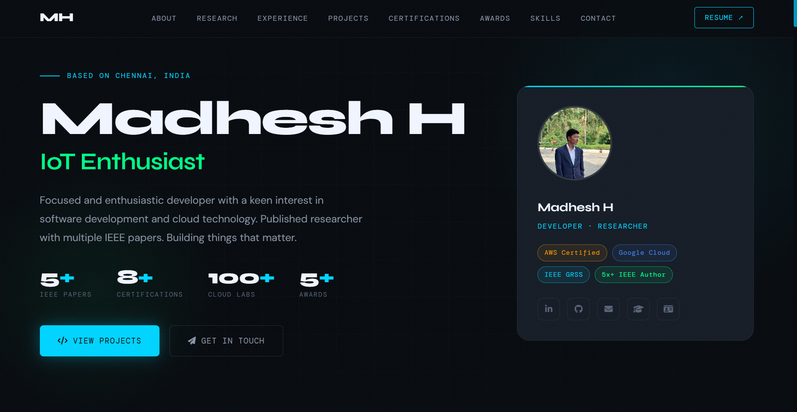
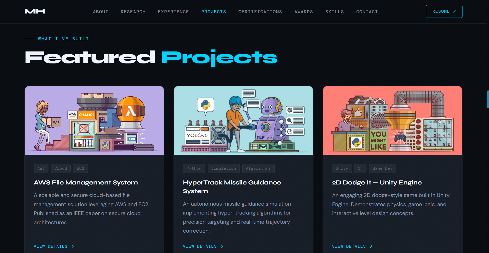
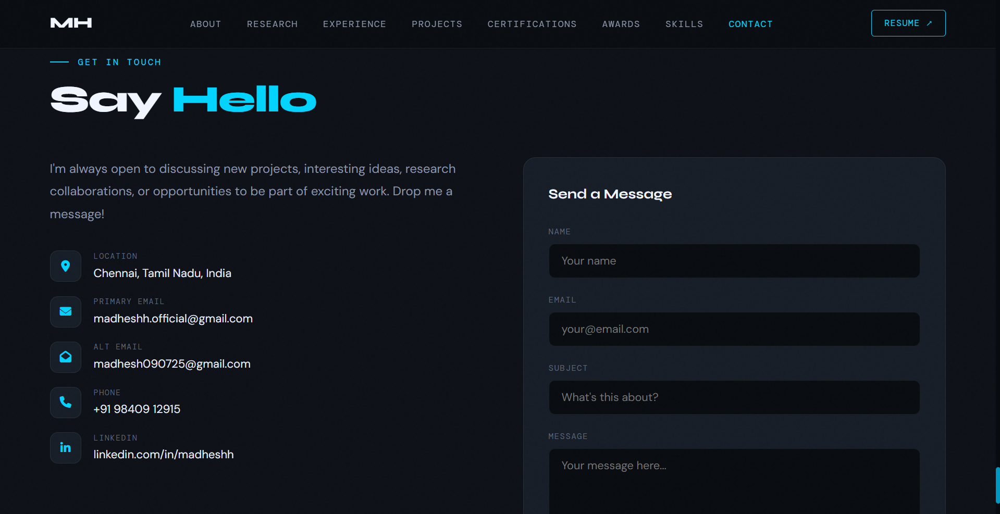

# Madhesh H — Personal Portfolio 🔥
**Live:** https://madhesh.vercel.app/

⭐ Star me on GitHub — it helps!

---

### Website Preview

#### Home Page


#### Projects Page


#### Contact Page


---

## Features 📋
⚡️ Fully Responsive  
⚡️ Valid HTML5 & CSS3  
⚡️ Typing animation  
⚡️ **Admin panel — update all content without touching code**  
⚡️ JSON-driven — all content lives in one file  
⚡️ Easy to deploy on Vercel, Netlify, or GitHub Pages  

---

## How It Works ⚙️

All content lives in **`portfolio-data.json`**.  
The site reads this file on every load and renders everything dynamically.  
The admin panel gives you a visual UI to edit that file — no code editor needed.

```
Edit in admin.html  →  Download portfolio-data.json  →  Replace file in folder  →  Site updates
```

---

## Files 📁

| File | Purpose |
|---|---|
| `index.html` | The live portfolio site (renders from JSON) |
| `admin.html` | Admin panel — edit all content visually here |
| `portfolio-data.json` | **All your content lives here** |
| `styles.css` | Visual styling |
| `script.js` | Mobile menu + scroll behavior |
| `assets/` | Images (profile, certs, projects, education) |
| `Certifications/` | Individual certification HTML pages |

---

## Sections 📚
✔️ Hero  
✔️ About  
✔️ Research / Publications  
✔️ Experience & Leadership  
✔️ Projects  
✔️ Certifications  
✔️ Awards  
✔️ Skills  
✔️ Education  
✔️ Online Works  
✔️ Important Links  
✔️ Contact  

---

## Editing Your Portfolio 🖊️

1. Open **`admin.html`** in your browser *(via a local server — see below)*
2. Edit any section using the sidebar
3. Click **"Save & Download JSON"**
4. Replace `portfolio-data.json` in your project folder
5. Refresh `index.html` — changes appear instantly

### Sections you can edit

| Section | What you can change |
|---|---|
| Hero | Name, bio, profile photo, stats, typed phrases, badges, social links |
| About | Bio paragraphs, birthday, location, email, phone, ORCID, ResearchGate |
| Research | IEEE papers — titles, years, links |
| Experience | Roles, organizations, periods, bullet points |
| Projects | Images, tags, descriptions, GitHub links |
| Certifications | Badge images, names, issuers, certificate pages |
| Awards | Emoji, titles, LinkedIn/Drive links |
| Skills | Categories and skill chips with optional icons |
| Education | Institution, degree, period, logo, courses |
| Online Works | Courses, badges, platforms, certificates |
| Links | GitHub, IEEE, Credly, LeetCode, and more |
| Contact | Intro text, location, emails, phone, LinkedIn |
| Site Settings | Nav logo initials, copyright year, IEEE profile URL |

---

## Running Locally 💻

> Opening HTML files directly with `file://` blocks JSON loading in most browsers. Use a local server instead.

**Python (recommended — built into Mac/Linux, available on Windows):**
```bash
cd path/to/portfolio-folder
python3 -m http.server 8080
```
Then open: `http://localhost:8080/admin.html`

**VS Code:**  
Install the **Live Server** extension → right-click `admin.html` → *Open with Live Server*

**Node.js:**
```bash
npx serve .
```

---

## Installation & Deployment 📦

#### Step 1 — Clone the repo
```bash
git clone https://github.com/madddx/portfolio.git
```

#### Step 2 — Edit your content
Open `admin.html` locally, update your details, download the JSON, replace the file.

#### Step 3 — Deploy to Vercel
- Push the folder to a GitHub repository
- Go to [vercel.com](https://vercel.com) → **Add New Project** → Import your repo
- Vercel auto-detects it as a static site → click **Deploy**
- Live in ~30 seconds at `https://your-project.vercel.app`

> Also works with **Netlify** (drag & drop at netlify.com/drop) and **GitHub Pages**.

### Updating content after deployment
```
Edit in admin.html  →  Download portfolio-data.json  →  Push to GitHub  →  Vercel auto-redeploys
```
You only ever push one file to update your live site.

---

## Adding a Profile Photo 🖼️
1. Copy your photo into `assets/img/`
2. In Admin → **Hero** → **Profile Photo Path**, enter: `assets/img/your-photo.jpg`
3. Save & Download JSON → replace the file

---

## Backup & Restore 💾
Use **Admin → Export / Import** to:
- Copy the current JSON to clipboard
- Download a backup of `portfolio-data.json`
- Paste an old backup to restore everything

---

## Troubleshooting 🔧

**Site shows blank / nothing loads**  
→ Use a local server — not `file://`. Run `python3 -m http.server 8080`

**Admin says "Could not load portfolio-data.json"**  
→ Same fix — open via a local server

**Changes not showing after replacing the JSON**  
→ Hard-refresh: `Ctrl+Shift+R` (Windows/Linux) or `Cmd+Shift+R` (Mac)

**Image not showing**  
→ Path must be relative to the project root: e.g. `assets/img/profile.jpg`

---

## Contributing 💡
1. 👯 Fork & clone this repo
2. 🔨 Make your changes
3. 🔃 Open a pull request

---

## License
[](http://badges.mit-license.org)

**[MIT license](http://opensource.org/licenses/mit-license.php)**
